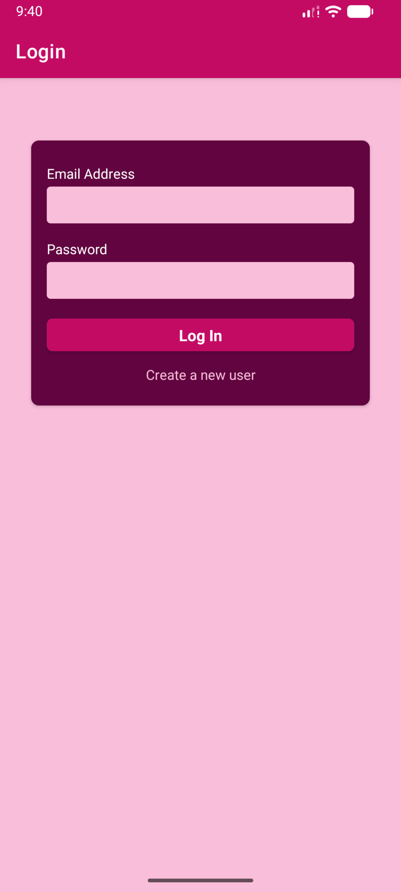

<div align="center">

<h1>🔐 AuthFlow</h1>
<p><strong>Authentication & Secure Navigation in React Native</strong></p>

<a href="https://git.io/typing-svg">
  
</a>

<br />

<p>
  
  
  
  
  
</p>

</div>

---

## 🎨 App Focus

<div align="center">

<table>
<tr>
<td align="center">🧭<br/><b>Navigation</b><br/>Auth stack<br/>Protected routes</td>
<td align="center">🔐<br/><b>Authentication</b><br/>Signup & login<br/>JWT tokens</td>
<td align="center">💾<br/><b>Persistence</b><br/>AsyncStorage<br/>Auto login</td>
<td align="center">⏱️<br/><b>Security</b><br/>Token refresh<br/>Expiration handling</td>
</tr>
</table>

</div>

---

## 🛠️ Tech Stack

<div align="center">


</div>

- React Native + Expo
- React Navigation (Native Stack)
- Firebase Authentication
- Context API
- AsyncStorage
- Axios

---

## ✨ Features

- 🔑 Email & password signup
- 🔐 Secure login flow
- 🛡️ Screen protection using auth state
- 🔄 Auto-login on app restart
- ⏱️ Refresh token before expiration
- 🚪 Logout with token cleanup
- ⚠️ Graceful authentication error handling

---

## 📸 Preview

<div align="center">



<br/><br/>

<p>
  <sub>
    Clean authentication flow · Protected screens · Secure logout
  </sub>
</p>

</div>


---

## 🔥 Firebase Setup (Required)

This app uses **Firebase Authentication (Email & Password)** via the **Firebase REST API**.

### 1️⃣ Create Firebase Project

- Go to **Firebase Console**
- Create a new project
- Enable **Email/Password Authentication**

### 2️⃣ Get Firebase Web API Key

- Project Settings → General
- Copy **Web API Key**

### 3️⃣ Add API Key to Expo Config

Update `app.json`:

```json
{
  "expo": {
    "extra": {
      "EXPO_PUBLIC_FIREBASE_API_KEY": "YOUR_FIREBASE_API_KEY"
    }
  }
}
```

## 🚀 Run Locally

```bash
git clone https://github.com/Shivam56291/react-native-learning-lab
cd AuthFlow
npm install
npx expo start
```

<div align="center"> <p>Built by <strong>Shivam</strong></p> <p>Focused on secure authentication & clean architecture</p> </div>
