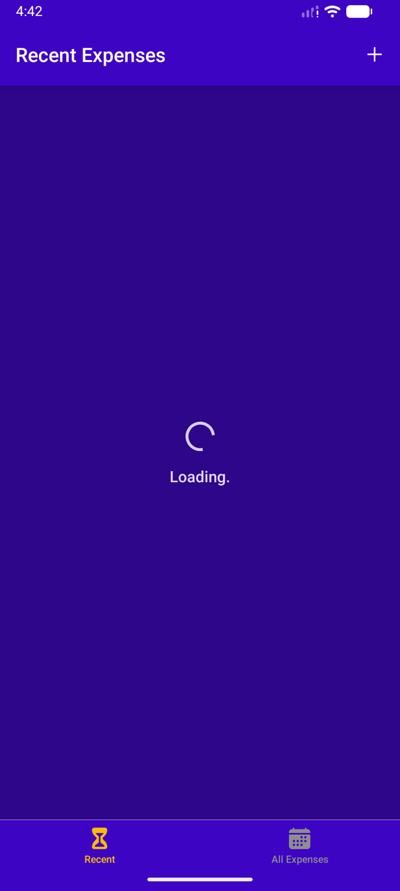

<div align="center">

<h1>💸 Expense Tracker</h1>
<p><strong>Track. Manage. Control your money.</strong></p>

<a href="https://git.io/typing-svg">
  
</a>

<br/>

<p>
  
  
  
  
</p>

</div>

---

## ✨ App Experience

<div align="center">

<table>
<tr>
<td align="center">📊<br/><b>Overview</b><br/>Readable expense list<br/>Clear date formatting</td>
<td align="center">✏️<br/><b>Manage</b><br/>Add, edit & delete<br/>Modal-based flow</td>
<td align="center">🎯<br/><b>UX</b><br/>Smooth navigation<br/>Tactile feedback</td>
</tr>
</table>

</div>

---

<h2 align="center">🧠 App Highlights</h2>

<div align="center">

🧭 React Navigation  🧠 Context API  🌐 Firebase Backend  
💾 Full CRUD (API)  🧩 Reusable Components  ⏳ Loading & Error UX

</div>

---

## 🛠️ Tech Stack

<div align="center">


</div>

- **Framework:** React Native + Expo
- **Navigation:** Stack Navigation
- **State Management:** Context API
- **Backend:** Firebase Realtime Database
- **Networking:** Axios (REST API)
- **Async UX:** Loading & Error Overlays
- **UI:** StyleSheet, Custom Buttons, Modals
- **Logic:** Full CRUD with backend sync

---

## 🌐 Backend & Data Flow

<div align="center">

🔗 **Firebase Realtime Database**  
📡 **Axios-based REST API**  
⏳ **Global Loading & Error Handling**

</div>

- Expenses are stored securely in Firebase
- Axios handles all HTTP requests (POST, GET, UPDATE, DELETE)
- Backend responses are transformed before updating state
- Global loading overlay during network calls
- Centralized error handling with user-friendly feedback

---

## 📸 Preview

<div align="center">



<p style="margin-top: 8px; font-size: 14px; color: #555;">Live preview showing backend sync, expense CRUD, validation errors, and loading states
</p>

</div>


---

## ✅ Features

- ➕ Add expenses with backend persistence
- ✏️ Edit & update existing expenses
- 🗑️ Delete expenses from Firebase
- 📥 Fetch expenses on app launch
- ⏳ Loading overlay during network requests
- ❌ Error overlay with retry support
- ✅ Form validation with visual feedback


---

## 🚀 Getting Started

```bash
git clone https://github.com/Shivam56291/react-native-learning-lab
cd ExpenseTracker
npm install
npx expo start
```

<div align="center">
  <h3>🔮 Roadmap</h3>
  <ul style="list-style: none; padding: 0;">
    <li>📈 Charts &amp; analytics</li>
    <li>💾 Persistent storage</li>
    <li>🌙 Dark mode</li>
    <li>🔍 Filters &amp; categories</li>
  </ul>
</div>

---

<div align="center"> <p>Built with focus & consistency by <strong>Shivam</strong></p> <p>💚 More features coming soon</p> </div> ```
