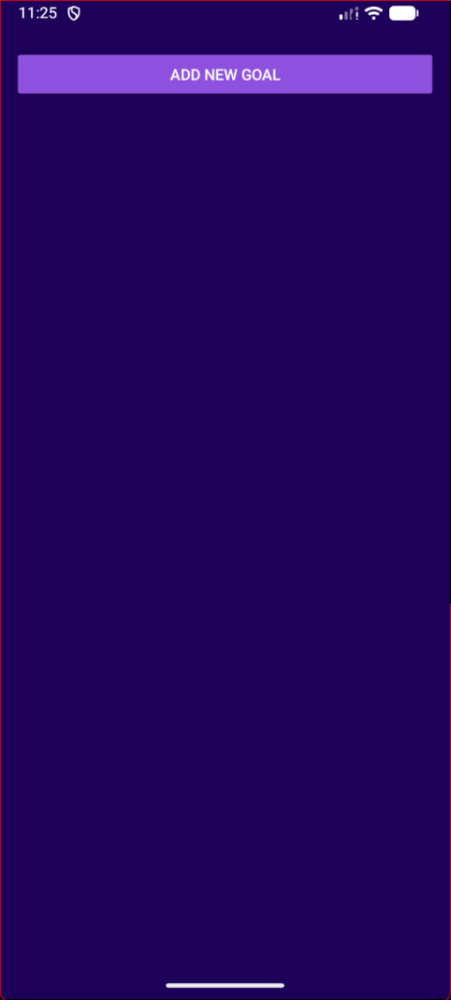
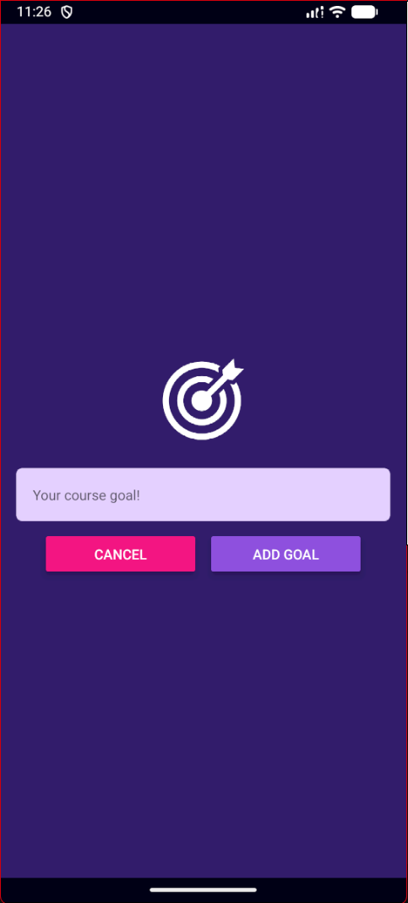
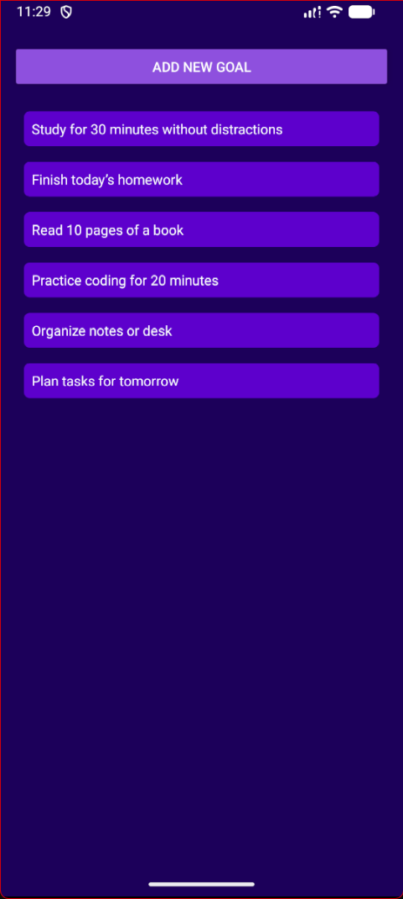

  <h1>🎯 FocusGoals</h1>
  
<strong>Stay focused. Achieve more.</strong>

  

    
    
    
  

---

### 📱 App Preview

  <table>
    <tr>
      <td align="center"><strong>Home Screen</strong></td>
      <td align="center"><strong>Add Goal Modal</strong></td>
      <td align="center"><strong>Ripple & Delete</strong></td>
    </tr>
    <tr>
      <td></td>
      <td></td>
      <td></td>
    </tr>
  </table>

---

### 🧠 Concepts Mastered

I built this application to master the core fundamentals of mobile development with React Native.

| Area              | Key Concepts Implemented                                                                                       |
| :---------------- | :------------------------------------------------------------------------------------------------------------- |
| **🎨 Layouts**    | **Flexbox Deep Dive** (Justify Content, Align Items), Dimensions API, Styling differences between iOS/Android. |
| **📜 Lists**      | **FlatList** for performance optimization (lazy loading) vs standard ScrollView.                               |
| **🕹 Interaction** | **Modals**, **Pressable** components, Custom Android Ripple effects, and Conditional Rendering.                |
| **🎣 State**      | Managing state across components (`useState`), Lifting State Up, and Props drilling.                           |

---

### 🛠 Tech Stack

  

- **Core:** React Native, Expo Go
- **Styling:** StyleSheet, Flexbox System
- **Components:** `FlatList`, `Modal`, `Pressable`, `Image`

---

 <small>Made by <strong>Shivam</strong></small> 

