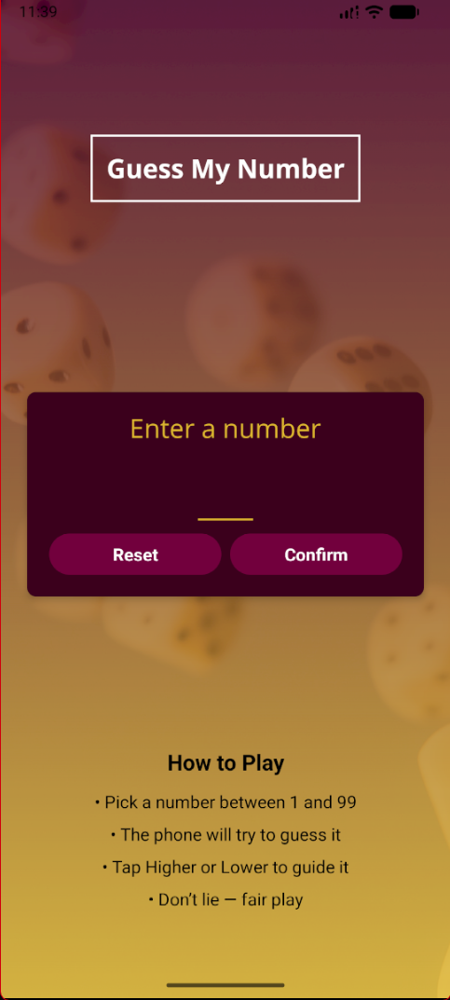
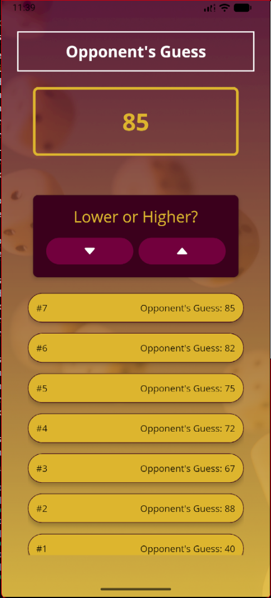
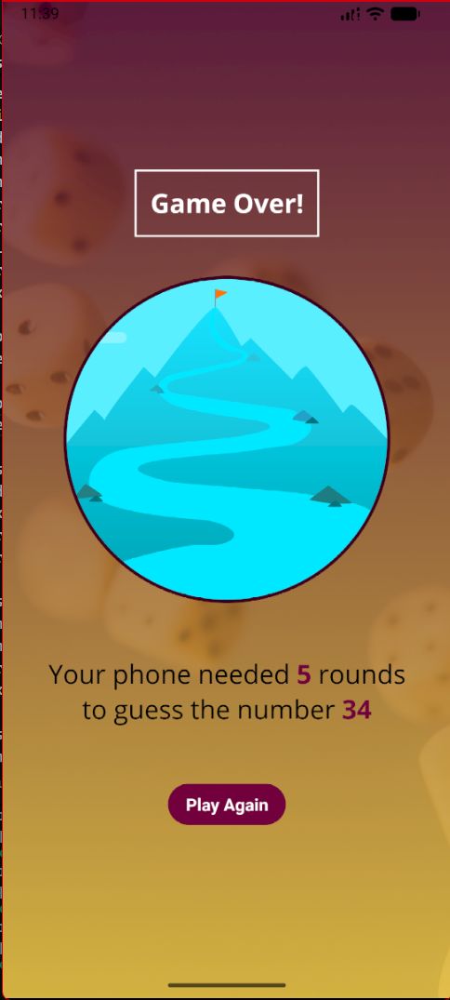

  <h1>🎲 Guess My Number</h1>
  
<strong>A Native Mobile Game built with React Native & Expo</strong>

  

   

  

    
    
    
    
  

---

### 📱 Game Preview

  <table>
    <tr>
      <td align="center"><strong>Start Game Screen</strong></td>
      <td align="center"><strong>Game Screen</strong></td>
      <td align="center"><strong>Game Over Screen</strong></td>
    </tr>
    <tr>
      <td></td>
      <td></td>
      <td></td>
    </tr>
  </table>

---

### 🎮 How to Play

| Step | Action | Tip |
| :--: | :---- | :-- |
| 1️⃣ | Pick a number between **1 and 99** | Make it any number in your mind |
| 2️⃣ | The phone will try to guess it | It uses a binary search algorithm |
| 3️⃣ | Tap **Higher** or **Lower** | Guide the phone closer to your number |
| 4️⃣ | Repeat until guessed | Be honest — no cheating! 😉 |
| 5️⃣ | Game Over | See how many rounds it took |

> 💡 Tip: Try to pick tricky numbers to challenge the computer’s guessing logic!

---

### 🚀 Mastered Concepts

I focused on building a polished UI and handling complex game logic.

| Module | Key Implementations |
| :--- | :--- |
| **🎨 Styling** | **Linear Gradients**, Background Images, Shadow Props (iOS vs Android), and **Global Color Management**. |
| **🧩 Components** | Building reusable **Custom Buttons**, **Card Wrappers**, and specific Input configurations. |
| **📱 Adaptation** | Using **SafeAreaView** for notch support and managing soft keyboards. |
| **🧠 Logic** | Implementing **Alerts**, Binary Search logic (Lower/Greater hints), and recursion. |
| **🔡 Typography** | Integrating **Custom Fonts** (Google Fonts) and using Icons (`@expo/vector-icons`). |
| **📜 Lists** | Using **FlatList** to render game logs efficiently. |

---

### 🛠 Tech Stack

  

- **Core:** React Native, Expo Go
- **UI:** `LinearGradient`, `ImageBackground`, `StyleSheet`
- **Icons:** Ionicons
- **Fonts:** Open Sans (via `expo-font`)

---

<medium>Made by <strong>Shivam</strong></medium>

