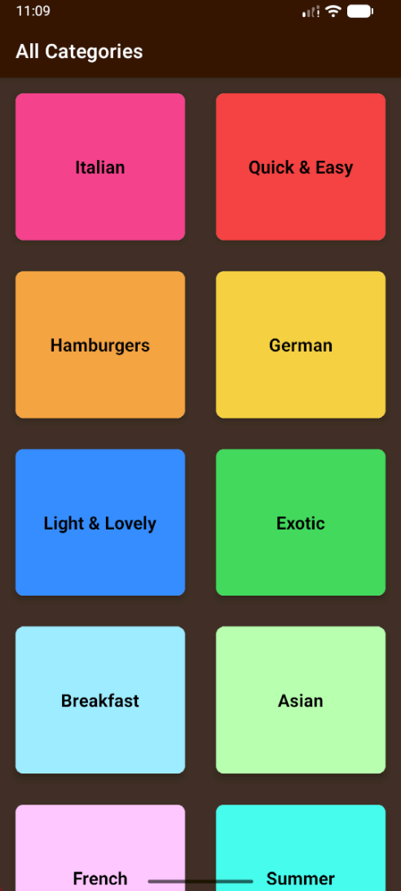
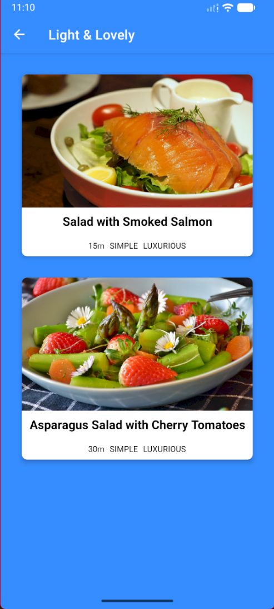
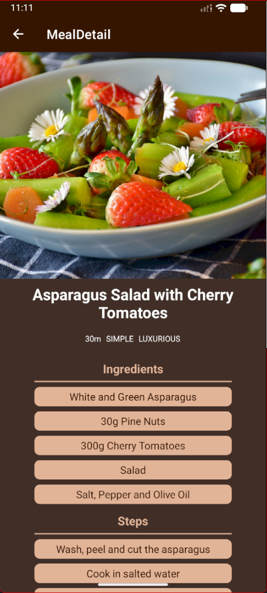

<div align="center">

  <h1>🍳 MealExplorer</h1>
  <p><strong>Culinary Inspiration in Your Pocket</strong></p>

  <a href="https://git.io/typing-svg">
    
  </a>

  <br />

  <p>
    
    
    
    
  </p>

</div>

---

### 🎨 Design & Experience

<div align="center">

|                       🍱 UI Architecture                       |                 ✨ Micro-Interactions                  |                        🥘 Core Features                         |
| :------------------------------------------------------------: | :----------------------------------------------------: | :-------------------------------------------------------------: |
| **Grid-Based Navigation** <br/> Clean, colorful tile interface | **Press Feedback** <br/> Tactile response on every tap |      **Favorites System** <br/> Save your best loved meals      |
|     **Card Layouts** <br/> Information-rich meal previews      |  **Smooth Transitions** <br/> Native stack navigation  | **Deep Filtering** <br/> Gluten-free, Vegan, & Dietary controls |
|   **Thematic Styling** <br/> Warm, appetizing color palette    |     **Header Effects** <br/> Dynamic title updates     |        **Rich Details** <br/> Step-by-step instructions         |

</div>

---

### 🛠️ Engineering Stack

<div align="center">

<br />


</div>

- **Core Engine:** React Native (v0.73+) with Expo
- **Navigation:** React Navigation (Native Stack) for performant screen switching
- **State Management:** React Context API / Redux (Scalable data flow)
- **Styling:** StyleSheet API with custom dimensional constraints
- **Assets:** Custom font integration & optimized image rendering

---

### 📸 App Gallery

<div align="center">
  <table>
    <tr>
      <td align="center"><b>All Categories</b></td>
      <td align="center"><b>Meals Overview</b></td>
      <td align="center"><b>Recipe Detail</b></td>
    </tr>
    <tr>
      <td align="center">
        
      </td>
      <td align="center">
        
      </td>
      <td align="center">
        
      </td>
    </tr>
  </table>
</div>

---

### 🚀 Quick Start

```bash
# Clone the repository
git clone https://github.com/yourusername/mealexplorer.git

# Navigate to project
cd mealexplorer

# Install dependencies
npm install

# Run on your device
npx expo start
```

---

<div align="center">

<p>Crafted by <strong>Shivam</strong></p>

</div>
